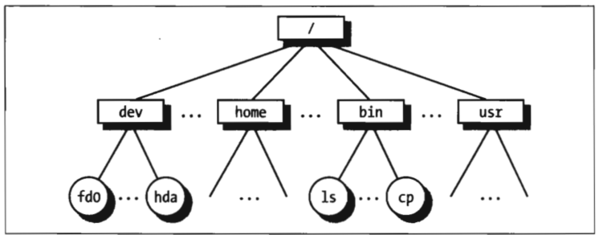

# 第一章 绪论

```mindmap
- 操作系统基本概念
  - 多用户系统
  - 进程
  - 内核体系结构
    - 微内核
    - 单块内核
- Unix文件系统
  - 文件
    - 文件类型
    - 文件描述符和索引节点
    - 文件操作和系统调用
  - 硬链接与软链接
- Unix内核概述
  - 进程/内核模式
  - 进程实现
  - 可重入内核
  - 进程地址空间
  - 同步和临界区
  - 信号和进程通信
  - 进程管理
  - 内存管理
  - 设备驱动程序
```

# 一、操作系统基本概念

任何计算机系统都包含一个名为**操作系统**的基本程序集合，在这个集合里，最重要的程序称为**内核（kernel）** 。当操作系统启动时，内核被装入到**RAM**中，内核中包含了系统运行必不可少的很多核心过程，系统根本的样子和能力是由内核决定的。

操作系统必须完成两个主要目标：

* 与硬件部分交互，为包含在硬件平台上的所有底层可编程部件提供服务。
* 为运行在计算机系统上的应用程序提供执行环境。

类Unix操作系统把与计算机物理组织相关的所有低层细节都对用户运行的程序隐藏起来。为了实施这种机制，现代操作系统依靠特殊的硬件特性来禁止用户程序直接与低层硬件部分进行交互，或者禁止直接访问任意的物理地址。特别是，硬件为CPU引入了至少两种不同的执行模式：用户程序的非特权模式和内核的特权模式。Unix把它们分别称为**用户态(User Mode)** 和**内核态(Kernel Mode)** 。

‍

## 1. 多用户系统

多用户系统(multiuser system)就是一台能并发和独立地执行分别属于两个或多个用户的若干应用程序的计算机。

 **“并发”(concurrently)** 意味着几个应用程序能同时处于活动状态并竟争各种资源，如CPU、内存、硬盘等等。

 **“独立”(independently)** 意味着每个应用程序能执行自己的任务，而无需考虑其他用户的应用程序在干些什么。

‍

多用户系统必须要包含以下特点：

* 核实用户身份的认证机制
* 防止有错误的用户程序妨碍其他应用程序再系统中运行的保护机制
* 防止有恶意的用户程序干涉或窥视其他用户的活动的保护机制
* 限制分配给灭个用户的资源数的记账机制。

‍

## 2. 进程

* 进程可以定义为：程序执行时的一个实例，或者一个运行程序的“执行上下文”。

* 允许进程并发活动的系统成为多道程序系统（multiprograming）或多处理系统(multiprocessing)。

一般来说，CPU的个数总是有限的，因而只有少数几个进程能同时执行。操作系统中叫做**调度程序(scheduler)** 的部分决定哪个进程能执行。

一些操作系统只允许有**非抢占式(nonpreemptable)** 进程，这就意味着，只有当进程自愿放弃CPU时，调度程序才被调用。但是，多用户系统中的进程必须是**抢占式的(preemptable)** ;操作系统记录下每个进程占有的CPU时间，并周期性地激活调度程序。

Unix是具有抢占式进程的多处理操作系统。类Unix操作系统采用**进程/内核模式**。每个进程都以为它是系统中唯一的进程，可以独占操作系统所提供的服务。只要进程发出系统调用（即对内核提出请求），硬件就会把特权模式由用户态转为内核态，然后进程以非常有限的目的开始一个内核过程的执行。

‍

## 3. 内核体系结构

大部分Unix内核是**单块结构（宏内核）** 。每个内核层都被集成到整个内核程序中，并代表当前进程在内核态下运行。相反，微内核操作系统只需要内核有一个很小的函数集，通常包括几个同步原语、一个简单的调度程序和进程间通信机制。

微内核设计将操作系统的核心功能（如进程调度、内存管理）保持在最小的内核中，而将其他功能（如文件系统、网络堆栈）作为用户空间的可加载模块。这些模块在用户态下运行，并通过消息传递与核心内核通信。

### 1) 微内核和单块内核对比

* 微内核的操作系统一般比单块内核的效率低。因为操作系统不同层次之间显示的消息传递需要花费一定的代价。
* 微内核操作方法比单块内核具有一定的理论优势。微内核操作系统迫使程序员采用模块化的方法，因为任何操作系统层都是一个相对独立的程序，这种程序必须通过定义明确且清晰的软件接口与其他层交互。
* 微内核操作系统可以很容易地移植到其他的体系结构上，因为所有与硬件相关的部分都被封装进微内核代码中。
* 最后，微内核操作系统比单块内核更加充分地利用了RAM，因为暂且不需要执行的系统进程可以被调出或撤销。

### 2) Linux使用模块

为了达到微内核理论上的很多优点又不影响性能，Linux内核提供了**模块（module）** 。模块是一个目标文件，其代码可以在运行时链接岛内和或从内核中解除链接。这种慕白哦代码通常由一组函数组成，用来实现文件系统、驱动程序或其他内核上层功能。

与微内核操作系统地外层不同，模块不是作为一个特殊地进程执行的，相反，与其他任何静态链接地内核函数一样，它代表当前进程在内核态下执行。

使用模块的主要优点包括：

* 模块化方法

  因为任何模块都可以运行时被链接或解除链接，因此，系统程序员必须提出良定义的软件接口以访问由模块处理的数据结构。
* 平台无关性

  即使模块依赖于某些特殊的硬件特点，但它不依靠于某个固定的硬件平台。
* 节省内存使用

  当需要模块功能时，把它链接到正在运行的内核中，否则，将该模块解除链接。
* 无性能损失

  模块的目标代码一旦被链接到内核，其作用与静态链接的内核的目标代码完全等价。因此，当模块的函数被调用时，无需显式地进行消息传递。

‍

# 二、 Unix文件系统

## 1. 文件

Unix文件是以字节序列组成的信息载体（container），内核不解释文件的内容。

从用户的观点来看，文件被组织在一个树结构地命名空间空间中，如图1-1所示。

​​


Unix每个进程都有一个当前工作目录，它属于进程执行上下文，表示出进程所用地当前目录。为表示一个特定的文件，进程使用路径名，路径名由斜杠以及一列指向文件的目录名交替组成。

如果路径名地第一个字符是斜杠，那这个路径就是绝对路径。因为它的起点是根目录。

否则，如果第一项是目录名或文件名，那么这个路径就是相对路径。

当标识文件名时，也用符号"." 和".." 分别标识当前工作目录和父目录。<u>如果当前目录是根目录，那么&quot;.&quot; 和&quot;..&quot;是一致的。</u>

	

## 2. 硬链接和软链接

### 1）. 硬链接

包含在目录中的文件名就是一个文件的**硬链接（hard link）** ，或简称链接(link)。在同一个目录或不同的目录中，同一文件可以有几个链接，因此对应几个文件名。

硬链接（Hard link）是文件系统中的一种链接类型，它允许一个文件拥有多个文件名（或路径）。当你创建一个硬链接时，实际上是在文件系统中创建了一个额外的目录项，该目录项指向了相同的数据块。这意味着通过任何一个链接访问文件都会得到相同的内容，因为它们实际上是同一个文件的不同名称。

```bash
ln P1 P2
```
用来创建一个新的硬链接，将P1标识的文件创建一个路径名为P2的硬链接。

具体来说，`ln`是用于创建链接的命令，而P1和P2是两个文件的路径。当你运行这个命令时，系统会在P2的位置创建一个新的链接文件，它指向P1。这意味着无论你使用P1还是P2访问文件，你都会看到同样的内容。修改其中一个文件将反映在另一个文件中，因为它们实际上是同一个文件的不同名称。

硬链接有两个方面的限制：

* 不允许用户给目录创建硬链接。防止目录树变为环形图。
* 只有在一个文件系统中的文件之间才能创建链接。

### 2）. 软链接

为了克服这些限制，引入了软链接（soft link）[也称符号链接（symbolic link)]。

符号链接是短文件，这些文件包含有另一个文件的任意一个路径名，路径名可以指向位于任意一个文件系统的任意文件或目录，甚至可以指向一个不存在的文件。


```bash
ln -s P1 P2
```

创建一个路径名为p2的新软链接，P2只想路径名P1。当这个命令执行时，文件系统抽出P2的目录部分，并在那个目录下创建一个名为P2的符号链接类型的新项。这个新文件包含路径名P1。这样，任何对P2的引用都可以被自动转换成一个指向P1的引用。

‍

## 3. 文件类型

Unix文件可以是下列类型之一：

* 普通文件（regular file）
* 目录
* 符号链接
* 面向快的设备文件
* 面向字符的设备文件
* 管道和命名管道
* 套接字

‍

## 4. 文件描述符与索引节点

文件描述符（File Descriptor）是操作系统内核为了访问文件而分配给进程的一种标识符。

除了设备文件和特殊文件系统文件外，每个文件都由字符序列组成。文件内容不包含任何控制信息，如文件长度或文件结束符（end-of-file, EOF）。文件系统处理文件需要的所有信息包含在一个名为**索引节点（inode）** 的数据结构中，每个文件都有自己的索引节点，文件系统用索引节点来标识文件。

‍

## 5. 访问权限和文件模式

文件的潜在用户分为三种类型：

* 作为文件所有者的用户
* 同组用户，不包括所有者
* 所有剩下的用户（其他）

有三种类型的访问权限

* 读
* 写
* 执行

	每组用户都有这三种权限。因此，文件访问权限就有九种不同的二进制来标记，还有三种附加的标记来定义文件的模式。

* suid

  进程执行一个文件时特产美国保持进程持有者的UID。然而，如果设置了可执行文件的suid的标志位，进程就获得了该文件拥有者的UID。
* sgid

  进程执行一个文件时保持进程组的用户组ID。然而，如果设置了可执行文件sgid的标志位，进程就获得了该文件用户组的ID。
* sticky

  设置了sticky标志位的可执行文件相当于向内核发出一个请求，当程序执行结束后，依然将他保留在内存。（这个标志已经过时，现在使用基于代码也共享的其他方法）

	当文件由一个进程创建时，文件拥有者的ID就是该进程的UID。其用户组ID可以是进程创建者的ID，也可以是父目录的ID，这取决于父目录sgid标志位的值。

‍

## 6. 文件操作的系统调用

**文件系统是硬盘分区物理组织的用户级视图。**

因为处于用户态的进程不能直接与低层硬件交互，所以每个实际的文件操作必须在内核态下进行。

### 1）打开文件

	进程只能访问“打开的”文件。为了打开一个文件，进程调用系统调用：

	fd = open(path,flag,mode)

这个系统调用创建一个“打开文件”对象，并返回文件描述符（file descriptor）的标识符。

一个人打开文件对象包括：

* 文件操作的一些数据结构，如指定文件打开方式的一组标志；表示文件当前位置的offset字段，从这个位置开始将进行下一个操作，等等。
* 进程可以调用一些内核函数指针，这组允许调用的函数集合由参数flag的值决定。

### 2）访问打开的文件

* lseek()

  newoffset = lseek(fd,offset,whence);
* read()

  nread = read(fs,buf,count);

### 3）关闭文件

	res = close(fd)

### 4）更名及删除文件

改变文件链接名字：

	res = rename(oldpath,newpath)

减少文件链接数

	res  = unlink(pathname)

文件链接数为0时，文件才被真正删除。

‍

# 三、Unix内核概述

Unix内核提供了应用程序可以运行的执行环境。因此，内核必须实现一组服务及相应的接口。应用程序使用这些接口，而且通常不会与硬件资源直接交互。

## 1. 进程/内核模式

当一个程序在**用户态**下执行时，它不能直接访问**内核数据结构**或**内核的程序**。然而，当应用程序在内核态下运行时，这些限制不再有效。

* <u>一个程序执行时，大部分时间都处在用户态下，只有需要内核所提供的服务时才切换到内核态。当内核满足了用户程序的请求后，它让程序又回到用户态下。</u>
* 内核本身并不是一个进程，而是进程的管理者。

 1. 在操作系统中，进程是程序的一个实例，它在系统中运行并拥有资源。通常，进程被视为系统中的基本执行单位。内核与进程不同，它不是一个在系统中运行的程序实例，而是操作系统的一部分。2. 内核是操作系统的核心组件，负责管理系统的资源和执行各种关键任务，如进程管理、内存管理、文件系统管理、设备驱动程序管理等。内核通过调度进程、分配内存、管理文件系统等方式来协调和管理系统的各种资源。3. 内核不是一个运行在系统中的进程，而是操作系统的核心组件，它负责管理并控制系统中的各种资源和任务，从而为运行在系统中的进程提供服务和支持。

**进程/内核模式**假定：请求内核服务的进程使用所谓**系统调用(system call)** 的特殊编程机制。每个系统调用都设置了一组识别进程请求的参数，然后执行与硬件相关的CPU指令完成从用户态到内核态的转换。

除用户进程之外，Unix系统还包括几个所谓**内核线程(kernel thread)的特权进程(** 被赋予特殊权限的进程),它们具有以下特点：

* 它们以内核态运行在内核地址空间。
* 它们不与用户直接交互，因此不需要终端设备。
* 它们通常在系统启动时创建，然后一直处于活跃状态直到系统关闭。

几种方式激活内核例程：

* 进程调用系统调用。
* 正在执行进程的CPU发出一个异常(exception)信号，异常是一些反常情况，例如一个无效的指令。内核代表产生异常的进程处理异常。
* 外围设备向CPU发出一个中断(interrupt)信号以通知一个事件的发生，如一个要求注意的请求、一个状态的变化或一个I/O操作已经完成等。每个中断信号都是由内核中的中断处理程序(interrupt handler)来处理的。因为外围设备与CPU异步操作，因此，中断在不可预知的时间发生。
* 内核线程被执行。因为内核线程运行在内核态，因此必须认为其相应程序是内核的一部分。

‍

## 2. 进程实现

为了让内核管理进程，每个进程由一个进程描述符（process descriptor）表示，这个描述符包含有关进程当前状态的信息。

当内核暂停一个进程的执行时，就把几个相关处理器寄存器的内容保存在进程描述符中，这些寄存器包括：

* 程序计数器（PC）和栈指针（SP）寄存器
* 通用寄存器
* 浮点寄存器
* 包含CPU状态信息的处理器控制寄存器（处理器状态字 Processor Status Word）
* 用来跟踪进程对RAM访问的内存管寄存器

‍

## 3. 可重入内核

所有的Unix内核都是可重入的，意味着若干个进程可以同时在内核态下执行。当然，在单处理器系统上只有一个进程在真正运行，但是有许多进程可能在等待CPU或某一I/O操作完成时在内核态被阻塞。

提供可重入的一种方式是编写函数，以便这些函数只能修改局部变量，而不能改变全局数据结构，这样的函数叫可重入函数。

如果一个**硬件中断**发生，**可重入内核**能挂起当前正在执行的进程，即使这个进程处于***内核态***。

‍

* 内核控制路径

‍

## 4. 进程地址空间

‍

* 在用户态下运行的进程涉及到**私有栈**、**数据区**和**代码区**。在内核态运行时，进程访问内核的数据区和代码区，但使用另外的私有栈。
* 尽管每个进程访问一个私有地址，但有时进程之间也共享部分地址空间。
* 进程间通信方式：共享内存

‍

‍

## 5.同步和临界区

实现可重入内核需要利用同步机制：

如果内核控制路径对某个内核数据结构进行操作时被挂起，那么,其他的内核控制路径就不应当再对该数据结构进行操作，除非它已被重新设置成一致性(consistent)状态。否则，两个控制路径的交互作用将破坏所存储的信息。

一般来说，对全局变量的安全访问通过原子操作（atomic operation）来保证。

然而，内核包含的很多数据结构无法用单一操作访问。例如，用单一的操作从链表中删除一个元素是不可能的，因为内核一次至少访问两个指针。临界区（critical region）是这样的一段代码，进入这段代码的·1进程必须完成，之后另一个进程才能进入。

几种同步技术已经被采用，具体如下：

### 1）非抢占式内核

在寻找彻底、简单的解决同步问题的方案中，大多数传统的Unix内核都是非抢占式的：当进程在内核态执行时，它不要被任意挂起，也不能被另一个进程替代。

### 2.）禁止中断

单处理器系统上的另一种同步机制是，在进入一个临界区之前禁止所有硬件中断，离开时再重新启用中断。

### 3.）信号量

广泛使用的一种机制是信号量（semaphore）。信号量仅仅是一个与数据结构相关的计数器。所有内核线程再试图访问这个数据结构之前，都要检查这个信号量。信号量组成如下：

* 一个整数变量
* 一个等待进程的链表
* 两个原子方法down()和up()

down()方法对信号量的值减1，如果这个新值小于0，九八正在运行的进程加入到这个信号量链表，然后阻塞改进程。

up()方法对信号量的值加1，如果心智大于或等于0，则激活这个信号量链表中的一个或多个进程。

每个要保护的数据结构都有它自己的信号量，其初始值为1。当内核控制路径希望访问这个数据结构时，它在相应的信号量上执行down()方法。如果信号量的当前值不是负数，则允许访问这个数据结构。否则，把执行内核控制路径的进程加入到这个信号量的链表并阻塞该进程。当另一个进程在那个信号量上执行up()方法时，允许信号量链表上的一个进程继续执行。#（问题：看不懂）#​

### 4）自旋锁

在多处理器系统中，信号量并不总是解决同步问题的最佳方案。系统不允许在不同CPU上运行的内核控制路径同时访问某些内核数据结构，在这种情况下，如果修改数据结构所需的时间比较短，那么,**信号量可能是很低效的**。为了检查信号量，内核必须把进程插入到信号量链表中，然后挂起它。因为这两种操作比较费时，完成这些操作时，其他的内核控制路径可能已经释放了信号量。

在这种情况下，多处理器操作系统使用了自旋锁（spin lock）。自旋锁与信号量非常相似，但没有进程链表。当一个进程发现锁被另一个进程锁着时，它就不停地“旋转”，执行一个紧凑的循环指令直到锁打开。

**自旋锁在单处理器环境下是无效的**。当内核控制路径试图访问一个上锁的数据结构时，它开始无休止循环。因此，内核控制路径可能因为正在修改受保护的数据结构而没有机会继续执行，也没有机会释放这个自旋锁。最后的结果可能是系统挂起。

‍

### 5）避免死锁

与其他控制路径同步地进程或内核控制路径很容易进入**死锁（deadlock）** 状态。有几种操作系统（包括Linux）是通过按规定的顺序请求信号量来避免死锁。

‍

‍

## 6. 信号和进程间通信

### 1）**信号**

提供了把系统事件报告给进程的一种机制。每种时间都有自己的信号编号，

* 异步通告：

  例如，用户终端按下中断键（CTRL_C）。即向前台进程发出中断信号SIGINT。

* 同步错误或异常

  例如，当进程访问非法地址时，内核向这个进程发送一个SIGSEGV信号。

POSIX标准定义了大约**20种**不同的信号，其中有**两种**是用户自定义的，可以当作用户态下进程通信和同步的原语机制。一般来说，进程可以以两种方式对接收到的信号做出反应：

* 忽略该信号
* 异步地执行一个指定的过程（信号处理程序）

### 2）信号量

### 3）消息队列

### 4）共享内存

最快的通信方式

‍

‍

## 7. 进程管理

**fork（）** 和 **_exit（）** 系统调用分别用来创建一个新**进程**和终止一个进程。

**exec（）** 类调用则是装入一个新程序。

	调用fork的进程是父进程，而新进程是它的子进程。父子进程能互相找到对方，因为描述每个进程地数据结构都包含两个指针，一个直接指向它的父进程，另一个直接指向它的子进程。

‍

### 僵尸进程

	父进程如何查询其子进程是否终止了呢？*wait4（）* 系统调用允许进程等待，直到其中的一个子进程结束，它返回已终止子进程的进程终止符。

‍

### 进程组和登录会话

现代Unix操作系统引入了进程组（process group）的概念，以表示一种作业（job）的抽象。

‍

现代Unix也引入了登录会话。一个登录会话包含在指定终端已经开始工作会话的进程的所有后代进程。（通常情况，登录会话就是shell进程为用户创建的第一条命令）

‍

‍

## 8. 内存管理

‍

### 虚拟内存

虚拟内存作为一种**逻辑层**，处于应用程序的内存请求与硬件内存管理单元之间。当进程使用一个虚拟地址时，内核和MMU（Memory Management Unit 内存管理单元）协同定位其在内存中的实际物理位置。

用途和优点：

* 若干个进程可以**并发**地执行。
* **应用程序所需内存大于可用物理内存时也可以运行**。
* 程序只有部分代码装入内存时进程可以执行它。
* 允许每个进程访问可用物理内存的子集。
* 进程可以共享库函数或程序的一个单独内存映像。
* 程序是可重定位的，也就是说，可以把程序放在物理内存的任何地方。
* 程序员可以编写与机器无关的代码，因为他们不必关心有关物理内存的组织结构。

‍

‍

### 随机访问存储器（RAM）的使用

所有的Unix操作系统都将RAM划分为两部分，其中若干兆字节专门用于存放**内核映像**(也就是内核代码和内核静态数据结构)。RAM的其余部分通常由虚拟内存系统来处理，并且用在以下三种可能的方面：

·   满足内核对缓冲区、描述符及其他动态内核数据结构的请求。

·   满足进程对一般内存区的请求及对文件内存映射的请求。

·   借助于高速缓存从磁盘及其他缓冲设备获得较好的性能。

‍

### 内核内存分配器

内核内存分配器（Kernel Memory Allocator, KMA）是一个子系统，试图马努在系统中所有部分对内存的请求。应该具有以下特点：

* 必须快
* 必须把内存的浪费减到最少
* 必须努力减轻内存的碎片问题
* 必须能与其他内存管理子系统合作，以便借用和释放页框。

基于几种不同的算法，有几种KMA，包括：

* 资源图分配算法
* 2的幂次方空闲链表
* McKusick-Karels分配算法
* **伙伴（Buddy）系统**
* **Solaris的Slab分配算法。**

Linux的KMA在伙伴系统之上采用了Slab分配算法。

‍

### 进程虚拟空间处理

	进程的虚拟地址空间包括了进程可以引用的所有虚拟内存地址。内核通常用一组内存区描述符描述进程虚拟地址空间。内核分配给进程的虚拟地址空间由以下内存区组成：

* 程序的可执行代码
* 程序的初始化数据
* 程序的未初始化数据
* 初始程序栈（即用户态栈）
* 所需共享库的可执行代码和数据
* 堆（由程序动态请求的内存）

所有现代Unix操作系统都采用了**请求调页(demand paging)** 的内存分配策略。有了请求调页，进程可以在它的页还没有在内存时就开始执行。当进程访问一个不存在的页时，MMU产生一个异常；异常处理程序找到受影响的内存区，分配一个空闲的页，并用适当的数据把它初始化。

同理，当进程通过调用malloc()或brk()(由malloc()在内部调用)系统调用动态地请求内存时，内核仅仅修改进程的堆内存区的大小。只有试图引用进程的虚拟内存地址而产生异常时，才给进程分配页框。

‍

### 高速缓存

物理内存的一大优势就是用作磁盘和其他块设备的高速缓存。这是因为硬盘非常慢：磁盘的访问需要数毫秒，与RAM的访问时间相比，这太长了。因此，磁盘通常是影响系统性能的瓶颈。通常，在最早的Unix系统中就已经实现的一个策略是：尽可能地推迟写磁盘的时间，因此，从磁盘读入内存的数据即使任何进程都不再使用它们，它们也继续留在RAM中。

这一策略的前题是有好机会摆在面前：新进程请求从磁盘读或写的数据，就是被撤消进程曾拥有的数据。当一个进程请求访问磁盘时，内核首先检查进程请求的数据是否在缓存中，如果在(把这种情况叫做**缓存命中**),内核就可以为进程请求提供服务而不用访问磁盘。

sync()系统调用把所有“脏”的缓冲区(即缓冲区的内容与对应磁盘块的内容不一样)写入磁盘来强制磁盘**同步**。为了避免数据丢失，所有的操作系统都会注意周期性地把脏缓冲区写回磁盘。

‍

## 9. 设备驱动程序

内核通过设备驱动程序（device driver）与I/O设备交互。

* 可以把特定设备的代码封装在特定的模块中。
* 厂商可以在不了解内核源代码而只知道接口规范的情况下，就能增加新的设备。
* 内核以统一的方式对待所有的设备，并且通过相同的接口访问这些设备。
* 可以把设备驱动程序写成模块，并动态地把它们装进内核而不需要重新启动系统。不再需要时，也可以动态地卸下模块，以减少存储在RAM中的内核映像的大小。

​​

‍
