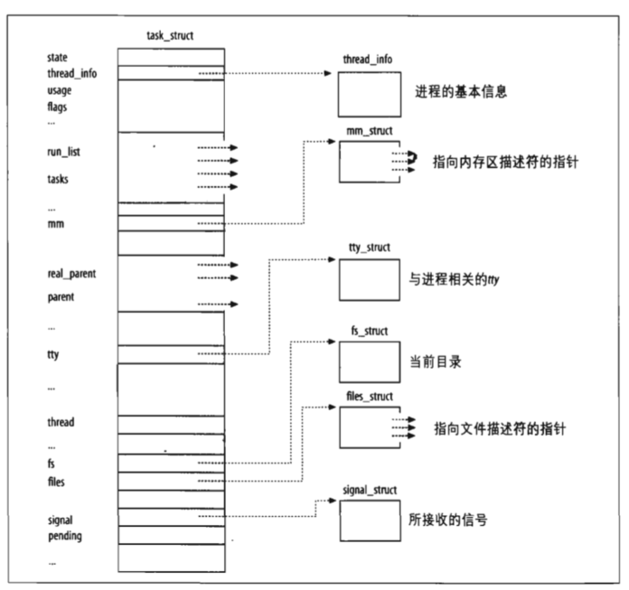
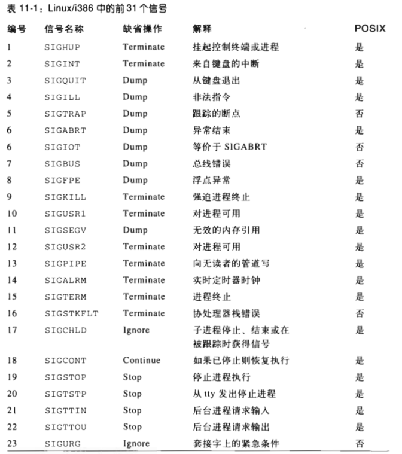
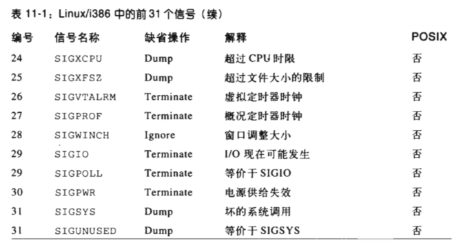

# 第三章 进程管理

‍

```mindmap
- 进程管理
  - 基本概念
    - 进程
    - 轻量级进程
    - 线程
  - 进程描述符
    - 进程状态
    - 标示一个进程
      - 进程描述符处理
      - 标识当前进程
      - 进程链表
    - 进程间的关系
  - 中断
  - 进程调度
  - 进程间的通信方式
    - 信号
    - 信号量
    - 消息队列
    - 共享内存
```

‍

# 一、进程、轻量级进程、线程

通常把进程定义为程序执行的一个实例。在Linux源代码中，常把进程称为**任务（task）** 或**线程（thread）** 。

* 进程是什么：**程序执行的实例**，
* 进程的目的：就是担当分配系统资源（CPU时间，内存等）的实体。
* Linux使用轻量级进程对多线程应用程序提供更好的支持。

‍

# 二、进程描述符

进程描述符是task_struct类型结构，它的字段包含了一个与进程相关的所有信息。

​​

## 1. 进程状态

	进程描述符中的state字段描述了进程当前所处的状态。在当前Linux版本种，这些状态是**互斥**的。

* 可运行状态

  进程要么在CPU种执行，要么准备执行。
* 可中断状态

  进程被挂起，直到某个条件变为真。产生一个硬件中断，释放进程正在等待的系统资源。

* 不可中断的等待状态

  与可中断的等待状态类似，但有一个例外，把信号传递到睡眠进程不能改变它的状态。这种状态很少用到，但在一些特定的情况下(进程必须等待，直到一个不能被中断的事件发生),这种状态是很有用的。

  例如，当进程打开一个设备文件，其相应的设备驱动程序开始探测相应的硬件设备时会用到这种状态。探测完成以前，设备驱动程序不能被中断，否则，硬件设备会处于不可预知的状态。
* 暂停状态

  进程的执行被暂停。接收到SIGSTOP、SIGSTP、SIGTTIN或SIGTTOU信号后，进入暂停状态。
* 跟踪状态

  进程的执行已由debugger程序暂停，当一个进程被另一个进程监控时（例如debugger执行ptrace（）系统调用监控一个测试程序），任何信号都可以把这个进程置于TASK_TRACED状态。

还有两个状态是既可以存放在进程描述符的state字段中，也可以存放在exit_state字段中，只有当进程的执行被终止后，进程的状态才会变为这两种状态中的一种。

* 僵死状态（EXIT_ZOMBIE）

* 僵死撤销状态（EXIT_DEAD）

‍

## 2. 标识一个进程

* **进程描述符指针**：进程和进程描述符之间有非常严格的一一对应关系，这使得用**32位进程描述符**​**地址**标识进程成为一种方便的方式。进程描述符指针指向这些地址，内核对进程的大部分引用都是通过进程描述符指针举行的。
* **进程标识符PID**：类Unix操作系统允许用户使用一个叫做进程标识符process ID (或PID)的数来标识进程。PID存放在进程描述符的pid字段，被顺序编号。达到上限（缺省情况下最大号是32726）循环到已闲置的小PID号。系统管理员可以通过往/proc/sys/kernel/pid_max这个文件来写入一个更小的值减小PID的上限值。
* Unix程序员希望同一组中的线程具有共同的PID。Linux引入线程组的表示，一个线程组中的所有线程使用和该线程组领头线程相同的PID。

‍

### 1） 进程描述符处理

‍

### 2）标识当前进程

‍

### 3） 进程链表

‍

## 3. 进程间的关系

* 父子关系/兄弟关系

‍

# 三、 中断

中断通常分为**同步（synchronous）** 和**异步（asynchronous）** 中断。

* 同步中断是当指令执行时由CPU控制单元产生的，之所以称为同步，是因为只有在一条指令中之执行后CPU才会发出中断。
* 异步中断是由其他硬件设备依照CPU时钟信号随机产生的。

	在Internel微处理器手册中，把同步和异步中断分别成为异常（exception）和中断（interrupt）。

‍

# 四、信号

(详见《深入理解Linux内核》第11章)

	信号在最早的Unix 系统中即被引入，用于在用户态进程间通信。内核也用信号通知进程系统所发生的事件。

## 1. **信号的作用**

	信号(signal)是很短的消息，可以被发送到一个进程或一组进程。发送给进程的唯一信 息通常是一个数，以此来标识信号。在标准信号中，对参数、消息或者其他相随的信息 没有给予关注。

	名字前缀为SIG 的一组宏用来标识信号。在前几章中，我们已经涉及到几个信号。例如， 在第三章的 “clone()、fork()及 vfork()系统调用”一节中已提及到的SIGCHLD  宏。在 Linux中，这个宏扩展为值17,当某一子进程停止或终止时，SIGCHLD 宏产生发送给父 进程的信号标识符。SIGSEGV 宏扩展为值11,在第九章的“缺页异常处理程序”一节中 已提及到：当一个进程引用无效的内存时，SIGSEGV 宏产生发送给进程的信号标识符。

使用信号的两个主要目的是：

* 让进程知道已经发生了一个特定的事件。
* 强迫进程执行它自己代码中的信号处理程序。

​​

​​

‍

# 五、进程调度

每个Linux 进程总是按照下面的调度类型被调度：

* SCHED_FIFO

  先进先出的实时进程。当调度程序把CPU 分配给进程的时候，它把该进程描述符 保留在运行队列链表的当前位置。如果没有其他可运行的更高优先级实时进程，进 程就继续使用CPU, 想用多久就用多久，即使还有其他具有相同优先级的实时进程 处于可运行状态。
* SCHED_RR

  时间片轮转的实时进程。当调度程序把CPU 分配给进程的时候，它把该进程的描 述符放在运行队列链表的末尾。这种策略保证对所有具有相同优先级的SCHED_RR 实时进程公平地分配CPU 时间。
* SCHED_NORMAL

  普通的分时进程。

除此之外，操作系统中常见的进程调度主要有：

1. 先来先服务
2. 最短服务时间
3. ddl优先
4. 按优先级排序服务
5. 时间片轮转

‍

# 六. 信号和进程间通信方式

(详见《深入理解Linux内核》第19章)

### 1）**信号**

提供了把系统事件报告给进程的一种机制。每种时间都有自己的信号编号，

* 异步通告：

  例如，用户终端按下中断键（CTRL_C）。即向前台进程发出中断信号SIGINT。

* 同步错误或异常

  例如，当进程访问非法地址时，内核向这个进程发送一个SIGSEGV信号。

POSIX标准定义了大约**20种**不同的信号，其中有**两种**是用户自定义的，可以当作用户态下进程通信和同步的原语机制。一般来说，进程可以以两种方式对接收到的信号做出反应：

* 忽略该信号
* 异步地执行一个指定的过程（信号处理程序）

### 2）信号量

### 3）消息队列

### 4）共享内存

最快的通信方式
