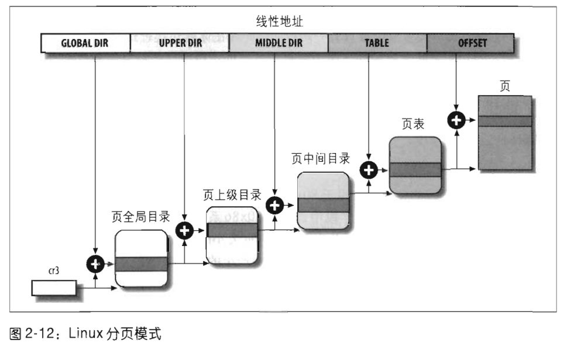

# 第二章 内存管理

本章介绍内存管理，《深入理解Linux内核》中关于内存管理的有三章，包括“第二章 内存寻址”、“第八章 内存管理”、“第九章 进程寻址空间”。

‍

```mindmap

- 内存管理
  - 内存地址
    - 逻辑地址
    - 线性地址
    - 物理地址
  - 硬件中的分段
    - 段选择符和段寄存器
    - 段描述符
    - 快速访问段描述符
    - 分段单元
  - Linux中的分段
    - Linux GDT
    - Linux LDT
  - 硬件中的分页
    - 常规分页
    - 扩展分页
    - 硬件保护方案
    - 转化后缓冲器 TLB
  - Linux中的分页
```

# 一、 内存地址

使用80x86微处理器时，必须区分以下三种不同的地址：

## 1. 逻辑地址 logical address

	包含在机器语言指令中用来指定一个操作数或一条指令的地址。这种寻址方式在80x86著名的分段结构中表现得尤为具体，它促使MS-DOS或Windows程序员把程序分成若干段。**每一个逻辑地址都由一个段(segment)和偏移量(offser或displacement)组成，偏移量指明了从段开始的地方到实际地址之间的距离。**

‍

## 2. 线性地址 linear address

（也称虚拟地址 virtual address）

	是一个32位无符号整数，用来表示高达4GB的地址也就是 4 294 967 296 个内存单元。线性地址通常用十六进制数字表示，范围从0x00000000 到0xffffffff。

‍

## 3. 物理地址 physical address

	用于内存芯片级内存单元寻址。它们与从微处理器的地址引脚发送到内存总线上的电信号相对应。物理地址由32位或36位无符号整数表示。

‍

## 4. 三者区别

	内存控制单元（MMU）通过一个称为**分段单元**的硬件电路把一个逻辑地址转换成线性地址，接着，通过**分页单元**的硬件电路把线性地址转换成逻辑地址。


逻辑地址、线性地址和物理地址是在计算机系统中描述内存地址的不同概念，它们之间的关系如下：

1. **逻辑地址（Logical Address）** ：

    * 逻辑地址是进程在其自己的地址空间中使用的地址。它是相对于进程自身的地址空间的地址值，不考虑物理内存地址。
    * 在逻辑地址空间中，每个进程都认为自己拥有一整块连续的地址空间，从0开始，通常是32位或64位。
    * 逻辑地址可以是程序员在编写程序时使用的虚拟地址，程序在执行时使用的地址就是逻辑地址。
2. **线性地址（Linear Address）** ：

    * 线性地址是在逻辑地址和物理地址之间的中间层。它通常是操作系统中的一种地址，用于将进程的逻辑地址映射到物理地址。
    * 线性地址空间可以看作是在逻辑地址空间和物理地址空间之间的一种映射关系，它将逻辑地址转换为物理地址。
    * 在现代操作系统中，线性地址通常由操作系统的内存管理单元（MMU）通过页表或段表等机制进行地址转换。
3. **物理地址（Physical Address）** ：

    * 物理地址是指实际的硬件内存地址，在计算机系统中用于访问物理内存单元。
    * 当程序访问内存时，其逻辑地址最终会被映射到物理地址，从而访问实际的内存单元。
    * 物理地址是由计算机的内存管理硬件（如MMU）将线性地址转换而来的，用于实际的数据读写操作。

综上所述，逻辑地址是进程自身使用的地址空间，线性地址是在逻辑地址和物理地址之间进行映射的中间层，而物理地址是实际用于访问硬件内存的地址。内存管理单元（MMU）负责将逻辑地址映射为线性地址，并将线性地址映射为物理地址，以实现内存的管理和地址的转换。

‍

#  二、硬件中的分段

从80286模型开始，Intel微处理器以两种不同的方式执行地址转换，分别是实模式和保护模式。本节重点描述保护模式下的地址转换。

实模式存在的主要原因是维持处理器与早期模型兼容，并让操作系统自举。

‍

## 1. 段选择符和段寄存器

一个逻辑地址由两部分组成：一个**段标识符**和一个指定段内相对地址的**偏移量**。

* 段标识符是一个**16位**长的字段，称为**段选择符**。
* 偏移量是一个**32位**长的字段。

	段寄存器的唯一目的是**存放段选择符，** 这些段寄存器称为cs、ss、ds、es、fs、和gs。

* cs 代码段寄存器，指向包含程序指令的段。
* ss 栈段寄存器，只想包含当前程序栈的段。
* ds 数据段寄存器，指向包含静态数据或全局数据段。

其他三个段寄存器作一般用途，可以指向任意的数据段。

**cs寄存器**还含有一个两位的字段，用以指明CPU的当前特权级（Current Privilege Level, CPL）值为0变送hi最高优先级，值为3表示最低优先级。

Linux只用0级和3级，分别称为**内核态**和**用户态**。

‍

## 2. 段描述符

每个段由一个8字节的段描述符（Segment Descriptor）表示，描述了段的特征。段描述符放在**全局描述符表(Global Descriptor Table, GDT)** 或**局部描述符表(Local Descriptor Table, LDT)** 中。

通常只定义一个GDT，每个进程除了存放在GDT中的段之外，如果还需要创建附加的段，就可以有自己的LDT。

GDT在主存中的地址和大小存放在**gdtr控制寄存器**中，当前正被使用的LDT地址和大小放在**ldtr控制寄存器**中。


‍

## 3. 快速访问段描述符

	逻辑地址由16位段选择符和32位段偏移量组成。**段寄存器仅仅存放段选择符**。

	快速访问段描述符（Fast Access Segment Descriptor）是一种优化技术，用于加速处理器访问段描述符的过程，从而提高内存分段管理的效率。

	在 x86 架构中，当程序访问内存时，处理器需要根据段选择符（Segment Selector）来选择对应的段描述符（Segment Descriptor），以获取要访问的内存段的基址和权限信息。通常情况下，处理器通过将段选择符作为索引来访问全局描述符表（Global Descriptor Table，GDT）或局部描述符表（Local Descriptor Table，LDT）中的段描述符。

	然而，直接从描述符表中访问段描述符可能会导致性能瓶颈，因为它需要进行内存访问操作，这可能会产生较长的延迟。为了优化这一过程，处理器通常会在内部维护一个快速访问缓存，用于存储最近使用过的段描述符。这个缓存中存储了一组最常用的段描述符，处理器可以在缓存中直接查找所需的段描述符，而不必每次都去访问描述符表。

	快速访问段描述符的主要优点包括：

1. **减少内存访问次数**：通过在处理器内部维护一个快速访问缓存，可以减少对描述符表的直接访问次数，从而降低了内存访问的延迟。
2. **提高访问速度**：由于快速访问缓存存储了最近使用过的段描述符，因此处理器可以更快地获取所需的段描述符，从而提高了访问速度。
3. **降低功耗**：减少了对描述符表的访问次数，可以降低系统的功耗，提高系统的能效。

总的来说，快速访问段描述符是一种用于优化内存分段管理的技术，通过在处理器内部维护一个快速访问缓存，可以提高对段描述符的访问速度和效率。

‍

## 4. 分段单元

分段单元（segmentation unit）将逻辑地址转换成相应的线性地址。

1. 先检查段选择符的TI字段，以决定段描述符保存在哪一个描述符表中。TI字段指明描述符是在GDT中(在这种情况下，分段单元从gdtr寄存器中得到GDT的线性基地址)还是在激活的LDT中(在这种情况下，分段单元从ldtr寄存器中得到LDT的线性基地址)。
2. 从段选择符的index字段计算段描述符的地址，index字段的值乘以8(一个段描述符的大小),这个结果与gdtr或ldtr寄存器中的内容相加。
3. 把逻辑地址的偏移量与段描述符Base字段的值相加就得到了线性地址。

‍

# 三、Linux中的分段

‍

* **Linux 内存主要采用的是页式内存管理，但同时也不可避免地涉及了段机制**。

这主要是上面 Intel 处理器发展历史导致的，因为 Intel X86 CPU 一律对程序中使用的地址先进行段式映射，然后才能进行页式映射。既然 CPU 的硬件结构是这样，Linux 内核也只好服从 Intel 的选择。**但是事实上，Linux 内核所采取的办法是使段式映射的过程实际上不起什么作用。**

分段可以给每一个进程分配不同的线性地址空间，而分页可以把同一线性地址映射到不同的物理空间。、与分段相比，Linux更喜欢分页方式。因为：

* 当所有进程使用相同的段寄存器值时，内存管理变得更简单，也就是说它们能共享同样的一组线性地址。
* Linux设计目标之一是可以把它移植到绝大多数流行的处理器平台上。然而，RISC体系结构对分段的支持很有限。

运行在**用户态**的所有Linux进程都使用一对相同的段来对指令和数据寻址。这两个段就是所谓的**用户代码段**和**用户数据段**。类似地，运行在**内核态**的所有Linux进程都使用一对相同的段对指令和数据寻址：它们分别叫做**内核代码段**和**内核数据段**。

**在Linux下逻辑地址与线性地址是一致的，即逻辑地址的偏移量字段的值与相应的线性地址的值总是一致的。**

‍

## 1. Linux GDT

在单处理器系统中只有一个GDT，而在多处理器系统中每一个CPU对应一个GDT。每个GDT包含**18个段描述符**和14个空的，未使用的，或保留的项。

每一个GDT中包含的的18个段描述符指向下列的段：

* 用户态和内核态下的代码段和数据段共4个。
* 任务状态段（TSS），每个处理器有1个。

每个TSS相应的线性地址空间都是内核数据段相应线性地址空间的一个小子集。所有的任务状态段都顺序地存放在init_tss数组中；值得特别说明的是，第n个CPU的TSS描述符的Base字段指向init_tss数组的第n个元素。G(粒度)标志被清0,而Limit字段置为0xeb,因为TSS段是236字节长。Type字段置为9或11(可用的32位TSS),且DPL置为0,因为不允许用户态下的进程访问TSS段。

* 1个包括缺省局部描述符表的段。（通常是被所有进程共享的段）
* 3个局部线程存储（Thread-Local Storage, TLS）段:这个机制允许多线程应用程序使用最多3个局部与线程的数据段。
* 与高级电源管理（AMP）相关的3个段。
* 与支持即插即用（PnP）功能的BIOS服务程序相关的5个段
* 被内核用来处理“双重错误”异常的特殊TSS段。

‍

## 2. Linux LDT

大多数用户态下的Linux程序不使用局部描述符表，这样内核就定义了一个缺省的LDT供大多数进程共享。、

在某些情况下，进程仍然需要创建自己的局部描述符

‍

# 四、硬件中的分页

分页单元（paging unit）把线性地址转换成物理地址。（其中的一个关键任务是把所请求的访问类型与线性地址的访问权限相比较，如果这次内存访问是无效的，就产生一个缺页异常）。

* 页：**线性地址被分成以固定长度为单位的组，被称为页（page）** 。页内部连续的线性地址被映射到连续的物理地址中。
* 页框：分页单元把所有的RAM分成固定长的**页框**（page frame）。没以恶搞页框包含一个页。也就是说一个页框的长度与一个页的长度一致。

（注意区分页和页框：页是一个数据块，可以存放在任何页框或磁盘中。）
* 页表：把线性地址映射到物理地址的数据结构被称为**页表（page table）** 。页表存放在主页中，并在启用分页单元之前必须由内核对页表进行适当的初始化。

‍

‍

## 1. 常规分页

线性地址的转换分两步完成，每一步都基于一种转换表，第一种转换表称为**页目录表**，第二种转换表称为**页表**。

使用**二级模式**的目的在于减少每个进程页表所需RAM的数量。没有必要马上为进程的所有页表都分配RAM，只有在进程实际需要一个页时才给该页分配RAM会更有效率。


## 2. 扩展分页

从Pentinum模型开始，80x86微处理器引入了扩展分页（extended paging）,它允许页框大小为4MB而不是4KB。

​​

## 3. 硬件保护方案

‍

## 4. 转化后缓冲器

转换后缓冲器TLB(Translation Lookaside Buffer)

‍

# 五、Linux中的分页

Linux 采用了一种同时适用于32位和64位系统的普通分页模型。两级页表对32位系统来说已经足够了，但64位系统需要更多数量的分页级别。直到2.6.10版本， Linux 采用三级分页的模型。从2.6.11版本 开始，采用了四级分页模型。4种页表分别被为：

* 页全局目录 (Page Global Directory)
* 页上级目录 (Page Upper Directory)
* 页中间目录 (Page Middle Directory)
* 页表 (Page Table)

​​

‍
