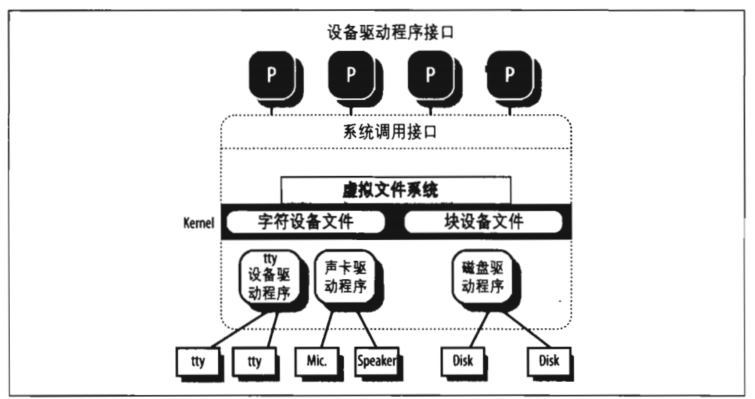

# 第五章 设备驱动

《深入理解Linux内核》 第十三章

```mindmap
- 设备驱动
  - 基本概念
  - I/O体系接口
    - I/O 端口
    - I/O 接口
      - 专用I/O接口
      - 通用I/O接口
    - 设备控制器
  - 设备驱动程序模型
  - 设备文件
  - 设备驱动程序
    - 注册设备驱动程序
    - 初始化设备驱动程序
    - 监控I/O操作
```

# 一、 基本概念

内核通过设备驱动程序（device driver）与I/O设备交互。

* 可以把特定设备的代码封装在特定的模块中。
* 厂商可以在不了解内核源代码而只知道接口规范的情况下，就能增加新的设备。
* 内核以统一的方式对待所有的设备，并且通过相同的接口访问这些设备。
* 可以把设备驱动程序写成模块，并动态地把它们装进内核而不需要重新启动系统。不再需要时，也可以动态地卸下模块，以减少存储在RAM中的内核映像的大小。

​​

‍

# 二、I/O 体系结构

为了确保计算机能够正常工作，必须提供数据通路，让信息在连接到个人计算机的 CPU 、RAM和I/O 设备之间流动。这些数据通路总称为总线，担当计算机内部主通信通道的作用。所有计算机都拥有一条系统总线，它连接大部分内部硬件设备。 一种典型的系统总线是 PCl(Peripheral Component Interconnect)总线。目前使用其他类型的总线也很多，例如ISA 、EISA 、MCA 、SCSI和 USB。

一台计算机包括几种不同类型的总线，它们通过被称作“桥”的硬件设备连接在一起。两条高速总线用于在内存芯片上来回传送数据：前端总线将CPU 连接到RAM控制器上，而后端总线将CPU直接连接到外部硬件的高速缓存上。主机上的桥将系统总线和前端总线连接在一起 **。任何I/O设备有且仅能连接一条总线。总线的类型影响1/O 设备的内部设计，也影响着内核如何处理设备。**

CPU 和I/O设备之间的数据通路通常称为I/O总线。这种连接使用了包含3个元素的硬件组织层次：**I/O端口**、**接口**和**设备控制器**。

​​

## 1. I/O端口

每个连接到I/O总线上的设备都有自己的I/O地址集，通常称为I/O端口(I/O port)。

有四条专用的汇编语言指令可以允许CPU 对1/0端口进行读写，它们是in,ins,out和outs。在执行其中的一条指令时，CPU 使用地址总线选择所请求的I/O端口，使用数椐总线在 CPU寄存器和端口之间传送数据。

## 2. I/O接口

I/O接口(I/O    interface)是处于一组I/O 端口和对应的设备控制器之间的一种硬件电路。 它起翻译器的作用，即把I/O端口中的值转换成设备所需要的命令和数据。在相反的方  向上，它检测设备状态的变化，并对起状态寄存器作用的I/O端口进行相应的更新。还 可以通过一条IRQ 线把这种电路连接到可编程中断控制器上，以使它代表相应的设备发  出中断请求。有两种类型的接口：

### 1） *专用I/0接口*

	专门用于一个特定的硬件设备。在一些情况下，设备控制器与这种I/O 接口处于同一块卡中。连接到专用I/O 接口上的设备可以是内部设备(位于PC 机箱内部的设备),也可以是外部设备(位于PC 机箱外部的设备)。

	常见的有如键盘接口、图形接口、磁盘接口、总线鼠标接口、网络接口。

### 2） *通用I/O* *接口*

	用来连接多个不同的硬件设备。连接到通用I/O接口上的设备通常都是外部设备。

	常见的有

#### *并口*

	传统上用于连接打印机，它还可以用来连接可移动磁盘、扫描仪、备份设备、其他 计算机等等。数据的传送以每次1字节(8位)为单位进行。

#### *串口*

	与并口类似，但数据的传送是逐位进行的。串口包括一个通用异步收发器(UART)芯片，它可以把要发送的字节信息拆分成位序列，也可以把接收到的位流重新组装 成字节信息。由于串口本质上速度低于并口，因此主要用于连接那些不需要高速操 作的外部设备，如调制解调器、鼠标以及打印机。

#### *PCMCIA* *接口*

	大多数便携式计算机都包含这种接口。在不重新启动系统的情况下，这种形状类似 于信用卡的外部设备可以被插入插槽或从插槽中拔走。最常用的PCMCIA 设备是 硬盘、调制解调器、网卡和扩展RAM。

#### *SCSI*   *(小型计算机系统接口)接口*

	是把PC 主总线连接到次总线(称为SCSI 总线)的电路。SCSI-2 总线允许一共8  个PC 和外部设备(硬盘、扫描仪、CR-ROM 刻录机等等)连接在一起。如果有附  加接口，宽带SCSI-2 和新的SCSI-3  接口可以允许你连接多达16个以上的设备。

SCSI 标准是通过SCSI 总线连接设备的通信协议。

#### 通用串行总线 (USB)

	高速运转的通用VO接口，可用于连接外部设备，代替传统的并口、串口以及SCSI接口。

## 3. 设备控制器

	复杂的设备可能需要一个设备控制器 (device controller) 来驱动。从本质上说，控制器起两个重要作用：

* 对从I/O接口接收到的高级命令进行解释，并通过向设备发送适当的电信号序列强 制设备执行特定的操作。
* 对从设备接收到的电信号进行转换和适当地解释，并修改(通过I/O接口)状态寄存器的值。

‍

# 三、设备驱动程序模型

新的硬件设备即使类型不同但也有相似的功能。对这种设备的驱动程序应当特别关注：

* 电源管理(控制设备电源线上不同的电压级别)
* 即插即用(配置设备时透明的资源分配)
* 热插拔(系统运行时支持设备的插入和移走)

系统中所有硬件设备由内核全权负责电源管理。例如，在以电池供电的计算机进入“待 机”状态时，内核应立刻强制每个硬件设备(硬盘、显卡、声卡、网卡、总线控制器等 等)处于低功率状态。

因此，每个能够响应“待机”状态的设备驱动程序必须包含一个回调函数，它能够使得硬件设备处于低功率状态。而且，硬件设备必须按准确的顺序进 入“待机”状态，否则一些设备可能会处于错误的电源状态。例如，内核必须首先将硬盘置于“待机”状态，然后才是它们的磁盘控制器，因为若按照相反的顺序执行，磁盘控制器就不能向硬盘发送命令。为了实现这些操作，Linux  2.6提供了一些数据结构和辅助函数，它们为系统中所有的总线、设备以及设备驱动程序提供了一个统一的视图；这个框架被称为设备驱动程序模型。

# 四、设备文件

Unix 操作系统都是基于文件概念的，文件是由字节序 列而构成的信息载体。根据这一点，可以把I/O 设备当作设备文件 (device file) 这种所 谓的特殊文件来处理；因此，与磁盘上的普通文件进行交互所用的同一系统调用可直接 用于I/O设备。

根据设备驱动程序的基本特性，设备文件可以分为两种：块和字符。这两种硬件设备之 间的差异并不容易划分，但我们至少可以假定以下的差异：

* 块设备的数据可以被随机访问，而且从人类用户的观点看，传送任何数据块所需的 时间都是较少且大致相同的。块设备的典型例子是硬盘、软盘、CD-ROM 驱动器 及 DVD 播放器。
* 字符设备的数据或者不可以被随机访问(考虑声卡这样的例子),或者可以被随机 访问，但是访问随机数据所需的时间很大程度上依赖于数据在设备内的位置(考虑磁带驱动器这样的例子)。

# 五、设备驱动程序

设备驱动程序是内核例程的集合，它使得硬件设备响应控制设备的编程接口，而该接口 是一组规范的VFS 函数集 (open,read,lseek,ioctl等等)。这些函数的实际实现由设备驱动程序全权负责。由于每个设备都有一个唯一的I/O 控制器，因此就有唯一的命令和唯一的状态信息，所以大部分I/O 设备都有自己的驱动程序。

* **注册设备驱动程序**
* **初始化设备驱动程序**
* **监控** **I/O** **操作**

‍
