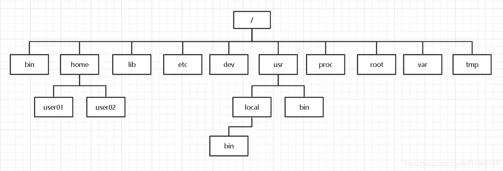

# 第四章 文件系统

```mindmap
- 文件系统
	1. 文件系统的基本组成
		- 索引节点
		- 目录项
	2. 虚拟文件系统
		- 磁盘文件系统
		- 内存文件系统
		- 网络文件系统
	3. 文件的使用
		- 文件描述符
	4. 文件的存储
		- 连续空间存放方式
		- 非连续空间存放方式
			- 链表方式
			- 索引方式
	5. 软链接与硬链接
	6. 文件I/O
		- 缓冲与非缓存I/O
		- 直接与非直接I/O
		- 阻塞与非阻塞I/O
```

# 1. 文件系统的基本组成

​​

‍
**文件系统是操作系统中负责管理持久数据的子系统**，负责把用户的文件存到磁盘硬件中，因为即使计算机断电了，磁盘里的数据并不会丢失，所以可以持久化的保存文件。

文件系统的基本数据单位是文件，它的目的是对磁盘上的文件进行组织管理，那组织的方式不同，就会形成不同的文件系统。

Linux 最经典的一句话是： **「一切皆文件」** ，不仅普通的文件和目录，就连块设备、管道、socket 等，也都是统一交给文件系统管理的。Linux 文件系统会为每个文件分配两个数据结构：**索引节点（index node）**  和 **目录项（directory entry）** ，它们主要用来记录文件的元信息和目录层次结构。

* 索引节点，也就是 `inode`​，用来记录文件的元信息，比如 inode 编号、文件大小、访问权限、创建时间、修改时间、数据在磁盘的位置等等。索引节点是文件的唯一标识，它们之间一一对应，也同样都会被存储在硬盘中，所以索引节点同样占用磁盘空间。
* 目录项，也就是 `dentry`​，用来记录文件的名字、索引节点指针以及与其他目录项的层级关联关系。多个目录项关联起来，就会形成目录结构，但它与索引节点不同的是，目录项是由内核维护的一个数据结构，不存放于磁盘，而是缓存在内存。  
  由于索引节点唯一标识一个文件，而目录项记录着文件的名，所以目录项和索引节点的关系是多对一，也就是说，一个文件可以有多个别字。比如，硬链接的实现就是多个目录项中的索引节点指向同一个文件。
* ‍

磁盘进行格式化的时候，会被分成三个存储区域，分别是**超级块**、**索引节点区**和**数据块区**。

* **超级块**，用来存储文件系统的详细信息，比如块个数、块大小、空闲块等等。
* **索引节点区**，用来存储索引节点；
* **数据块区**，用来存储文件或目录数据；

‍

# 2. 虚拟文件系统

(详见《深入理解Linux内核》第12章)

虚拟文件系统所隐含的思想是把表示很多不同种类文件系统的共同信息放入内核；其中有一个字段或函数来支持Linux 所支持的所有实际文件系统所提供的任何操作。对所调用的每个读、写或其他函数，内核都能把它们替换成支持本地Linux 文件系统、NTFS  文件系统，或者文件所在的任何其他文件系统的实际函数。

文件系统的种类众多，而操作系统希望**对用户提供一个统一的接口**，于是在用户层与文件系统层引入了中间层，这个中间层就称为**虚拟文件系统（Virtual File System，VFS）** 。VFS 定义了一组所有文件系统都支持的数据结构和标准接口，这样程序员不需要了解文件系统的工作原理，只需要了解 VFS 提供的统一接口即可。

根据存储位置的不同，可以把文件系统分为三类：

* **磁盘的文件系统**，它是直接把数据存储在磁盘中，比如 Ext 2/3/4、XFS 等都是这类文件系统。
* **内存的文件系统**，这类文件系统的数据不是存储在硬盘的，而是占用内存空间，我们经常用到的 /proc 和 /sys 文件系统都属于这一类，读写这类文件，实际上是读写内核中相关的数据数据。
* **网络的文件系统**，用来访问其他计算机主机数据的文件系统，比如 NFS、SMB 等等。  
  文件系统首先要先挂载到某个目录才可以正常使用，比如 Linux 系统在启动时，会把文件系统挂载到根目录。

‍

# 3. 文件的使用

打开了一个文件后，操作系统会跟踪进程打开的所有文件，所谓的跟踪呢，就是操作系统为每个进程维护一个打开文件表，文件表里的每一项代表  **「文件描述符」** ，所以说文件描述符是打开文件的标识。

操作系统在打开文件表中维护着打开文件的状态和信息：

* 文件指针：系统跟踪上次读写位置作为当前文件位置指针，这种指针对打开文件的某个进程来说是唯一的；
* 文件打开计数器：文件关闭时，操作系统必须重用其打开文件表条目，否则表内空间不够用。因为多个进程可能打开同一个文件，所以系统在删除打开文件条目之前，必须等待最后一个进程关闭文件，该计数器跟踪打开和关闭的数量，当该计数为 0 时，系统关闭文件，删除该条目；
* 文件磁盘位置：绝大多数文件操作都要求系统修改文件数据，该信息保存在内存中，以免每个操作都从磁盘中读取；
* 访问权限：每个进程打开文件都需要有一个访问模式（创建、只读、读写、添加等），该信息保存在进程的打开文件表中，以便操作系统能允许或拒绝之后的 I/O 请求；

‍

# 4. 文件的存储

文件的数据是要存储在硬盘上面的，数据在磁盘上的存放方式，就像程序在内存中存放的方式那样，有以下两种：

* 连续空间存放方式
* 非连续空间存放方式

  非连续空间存放方式分为「链表方式」和「索引方式」。

‍

# 5. 软链接与硬链接

有时候我们希望给某个文件取个别名，那么在 Linux 中可以通过硬链接（Hard Link） 和软链接（Symbolic Link） 的方式来实现，它们都是比较特殊的文件，但是实现方式也是不相同的。

硬链接是多个目录项中的「索引节点」指向一个文件，也就是指向同一个 inode，但是 inode 是不可能跨越文件系统的，每个文件系统都有各自的 inode 数据结构和列表，所以硬链接是不可用于跨文件系统的。由于多个目录项都是指向一个 inode，那么只有删除文件的所有硬链接以及源文件时，系统才会彻底删除该文件。

软链接相当于重新创建一个文件，这个文件有独立的 inode，但是这个文件的内容是另外一个文件的路径，所以访问软链接的时候，实际上相当于访问到了另外一个文件，所以软链接是可以跨文件系统的，甚至目标文件被删除了，链接文件还是在的，只不过指向的文件找不到了而已。

‍


# 6. 文件I/O

‍

文件的读写方式各有千秋，对于文件的 I/O 分类也非常多，常见的有

‍

## 1） 缓冲与非缓冲 I/O

文件操作的标准库是可以实现数据的缓存，那么根据「是否利用标准库缓冲」，可以把文件 I/O 分为缓冲 I/O 和非缓冲 I/O：

* 缓冲 I/O，利用的是标准库的缓存实现文件的加速访问，而标准库再通过系统调用访问文件。
* 非缓冲 I/O，直接通过系统调用访问文件，不经过标准库缓存。

这里所说的「缓冲」特指标准库内部实现的缓冲。

比方说，很多程序遇到换行时才真正输出，而换行前的内容，其实就是被标准库暂时缓存了起来，这样做的目的是，减少系统调用的次数，毕竟系统调用是有 CPU 上下文切换的开销的

## 2）直接与非直接 I/O

我们都知道磁盘 I/O 是非常慢的，所以 Linux 内核为了减少磁盘 I/O 次数，在系统调用后，会把用户数据拷贝到内核中缓存起来，这个内核缓存空间也就是「页缓存」，只有当缓存满足某些条件的时候，才发起磁盘 I/O 的请求。

那么，根据是「否利用操作系统的缓存」，可以把文件 I/O 分为直接 I/O 与非直接 I/O：

* 直接 I/O，不会发生内核缓存和用户程序之间数据复制，而是直接经过文件系统访问磁盘。
* 非直接 I/O，读操作时，数据从内核缓存中拷贝给用户程序，写操作时，数据从用户程序拷贝给内核缓存，再由内核决定什么时候写入数据到磁盘。

如果你在使用文件操作类的系统调用函数时，指定了 `O_DIRECT`​ 标志，则表示使用直接 I/O。如果没有设置过，默认使用的是非直接 I/O。

> 如果用了非直接 I/O 进行写数据操作，内核什么情况下才会把缓存数据写入到磁盘？  
> 以下几种场景会触发内核缓存的数据写入磁盘：

* 在调用 `write`​ 的最后，当发现内核缓存的数据太多的时候，内核会把数据写到磁盘上；
* 用户主动调用 `sync`​，内核缓存会刷到磁盘上；
* 当内存十分紧张，无法再分配页面时，也会把内核缓存的数据刷到磁盘上；
* 内核缓存的数据的缓存时间超过某个时间时，也会把数据刷到磁盘上

## 3）阻塞与非阻塞 I/O VS 同步与异步 I/O

先来看看阻塞 I/O，当用户程序执行 `read`​ ，线程会被阻塞，一直等到内核数据准备好，并把数据从内核缓冲区拷贝到应用程序的缓冲区中，当拷贝过程完成，`read`​ 才会返回。

注意，阻塞等待的是「内核数据准备好」和「数据从内核态拷贝到用户态」这两个过程。过程如下图：

‍

参考链接：

《深入理解Linux内核》

[7.1 文件系统全家桶 | 小林coding (xiaolincoding.com)](https://xiaolincoding.com/os/6_file_system/file_system.html#%E6%96%87%E4%BB%B6%E7%B3%BB%E7%BB%9F%E7%9A%84%E5%9F%BA%E6%9C%AC%E7%BB%84%E6%88%90)

[【底层原理】彻底理解Linux文件系统 - 知乎 (zhihu.com)](https://zhuanlan.zhihu.com/p/632638835)
